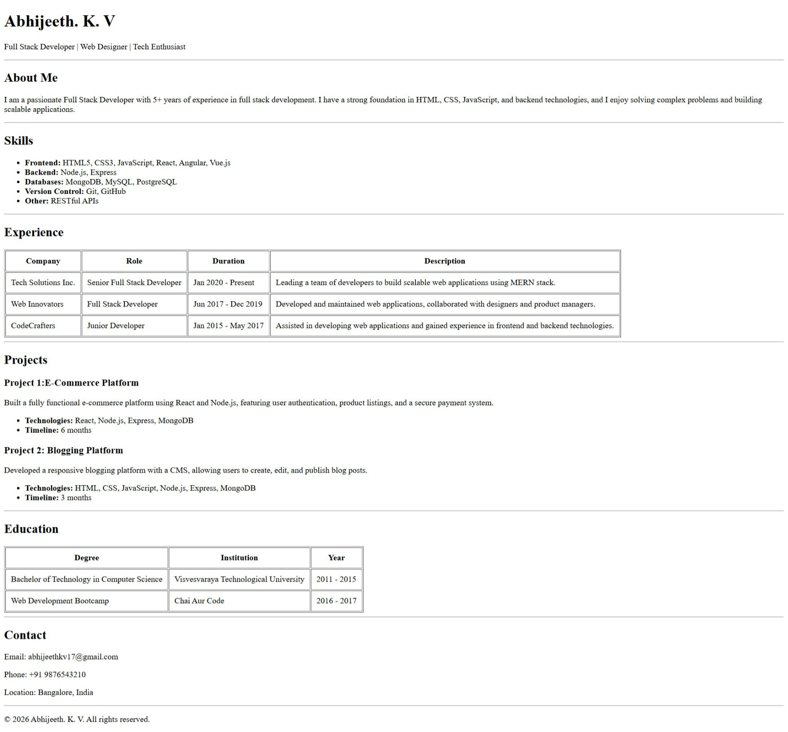

# HTML Resume Assignment

A semantic and structured personal resume built entirely with **HTML5**. This project was designed as a foundational web development assignment to demonstrate proficiency in document structure, tables, and lists without the use of external CSS frameworks.



## 🚀 Features

The resume is divided into several logical sections for easy readability and accessibility:

* **Header:** Displays name and professional titles.
* **About Me:** A brief professional summary.
* **Skills:** Categorized technical competencies using unordered lists.
* **Experience:** A detailed professional history presented in a structured `<table>`.
* **Projects:** Highlights of key work with technology stacks and timelines.
* **Education:** Academic background and certifications in a tabular format.
* **Contact:** Direct links and location information.

---

## 🛠️ Technologies Used

* **HTML5:** Used for semantic structure (header, footer, div, sectioning).
* **Tables:** For organized data representation of work and education history.
* **Lists:** To showcase skills and project details.

---

## 📂 Project Structure

```text
.
└── index.html  # Main HTML document
```

## ⚙️ How to Run
1. Clone or Download this repository to your local machine.
2. Navigate to the project folder.
3. Open index.html in any modern web browser (Chrome, Firefox, Edge, or Safari).
4. Alternatively: Right-click the file and select "Open With" > [Your Browser].

## 📝 Author
Abhijeeth. K. V

## 📄 License
This project is for educational purposes. Feel free to use it as a template for your own HTML resume.

Note: This resume was created as part of a Web Development curriculum (Chai Aur Code).
